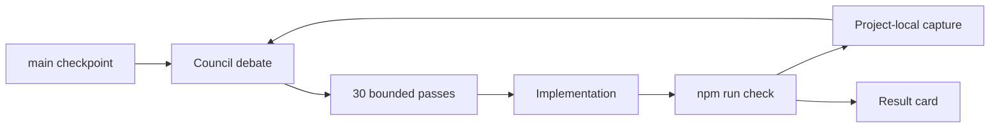
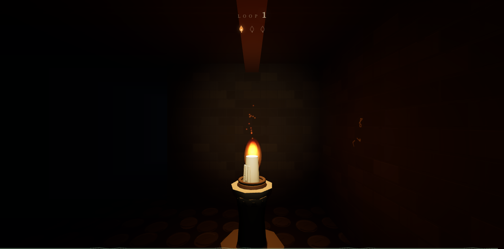
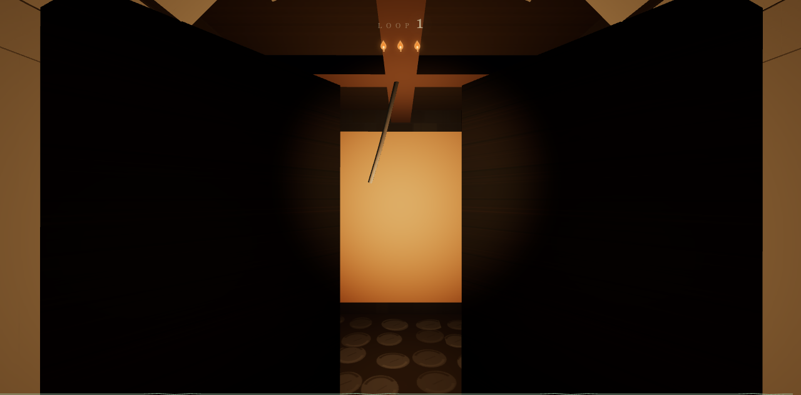
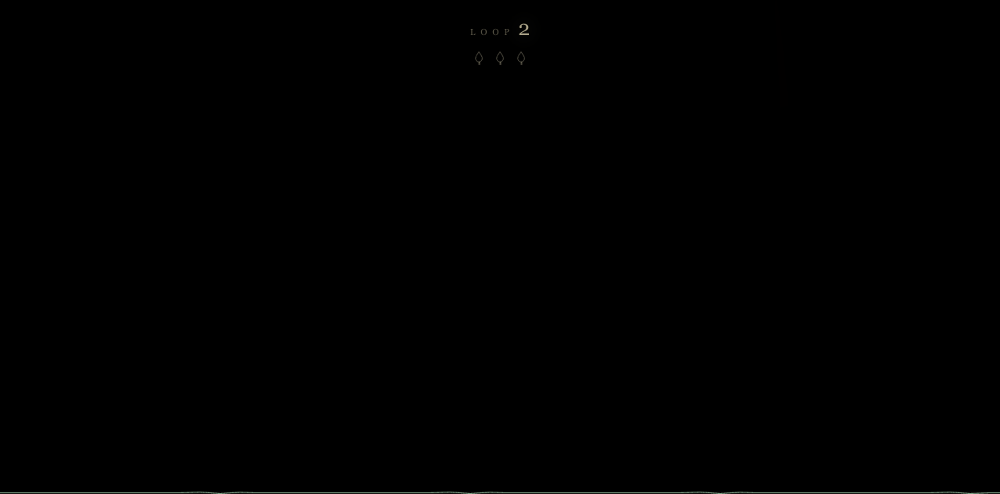
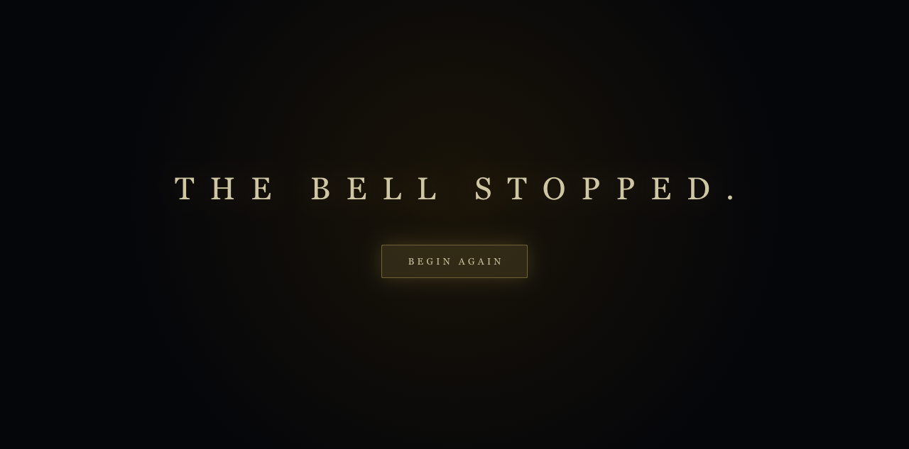
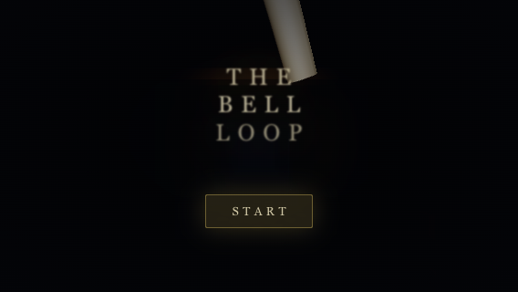
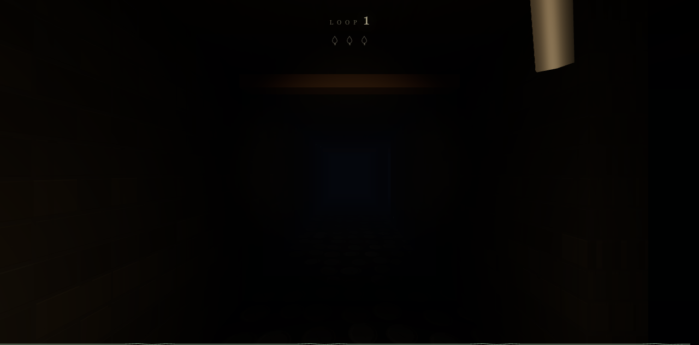
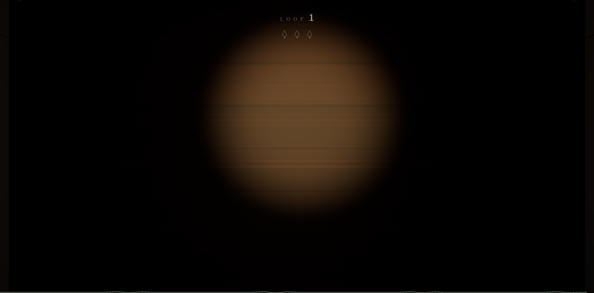

# THE BELL LOOP — STEALTH / SPACE-BUNNY

A first-person temporal horror maze built with Vite, React, and Three.js. The bell tolls every 60 seconds, the maze rearranges deterministically, three candle shrines persist across loops, and the center door opens after the third candle.

This branch is a benchmark result built from `main` checkpoint `d7b7b64`. The complete workflow, statistics, captures, and implementation delta are recorded here.

## Run card

| Field | Value |
| --- | --- |
| Provider | OpenCode |
| Model | `space-bunny-free` |
| Variant | `max` |
| Result branch | `stealth/space-bunny` |
| Checkpoint branch | `main` |
| Checkpoint commit | `d7b7b64` |
| Status | Candidate |
| Deployment | Pending |

## Stats

| Metric | Value |
| --- | ---: |
| Runs | 1 |
| Improvement passes | 30 |
| Task calls | 127 |
| Persisted agents | 123 |
| General agents | 109 |
| Explore agents | 14 |
| Wall time | 137,620,751 ms / 1d 14h 13m 40.751s |
| Aggregate agent time | 54,834,840 ms / 15h 13m 54.840s |
| Input tokens | 20,377,902 / 20.377902M |
| Output tokens | 951,504 / 0.951504M |
| Reasoning tokens | 2,747,996 / 2.747996M |
| Cache read | 502,587,723 / 502.587723M |
| Cache write | 0 |
| Non-cache tokens | 24,077,402 / 24.077402M |
| Total tokens | 524,665,125 / 524.665125M |
| Cost | $0.00 |
| Pure checks | 35/35 |
| World checks | 23/23 |
| Production build | Pass |

Token totals are the cumulative OpenCode session snapshot for the main agent and persisted subagents. Non-cache tokens are input + output + reasoning; total tokens additionally include cache reads.

## Workflow



Each pass used a read-only council, a bounded implementation, a quality gate, and a project-local screenshot. The run used 127 task calls across 123 persisted agent sessions: 109 `general` reviews and 14 `explore` reviews.

## Pass ledger

| Pass | Focus | Result |
| ---: | --- | --- |
| 01 | Baseline audit | Flashlight fill and range increased. |
| 02 | Entrance lighting | Spawn practical lowered and stabilized. |
| 03 | Flashlight exposure | Decay retuned for readable falloff. |
| 04 | Candle falloff | Shrine candle intensity increased. |
| 05 | Door atmosphere | Beyond panel changed to shaded material. |
| 06 | Fog balance | Visibility distance increased. |
| 07 | Wall texture scale | Brick repeat retuned. |
| 08 | Floor texture | Cobble cell scale and repeat corrected. |
| 09 | Material response | Iron and shrine response retuned. |
| 10 | Decal wear | Wall decal standoff corrected. |
| 11 | Shrine readability | Soft ember sprite added. |
| 12 | Door construction | Backing panel alignment corrected. |
| 13 | Corridor props | Beam instances recentered across the maze. |
| 14 | Storytelling | Handprint smear linked to the boat. |
| 15 | Particles | Ember lateral sway widened. |
| 16 | Camera | Title drift ordering fixed. |
| 17 | Interaction | Shrine prompts gated by wall line-of-sight. |
| 18 | Reset clarity | Fade completion aligned with control hand-off. |
| 19 | State feedback | Armed door hint light added. |
| 20 | Spatial audio | Door creak panner and listener added. |
| 21 | Event audio | Bell echo timing anchored to each toll. |
| 22 | Lifecycle | Pause releases pointer lock. |
| 23 | Review presets | Store and scene state reset coherently. |
| 24 | Performance | Two wall meshes merged into one instanced mesh. |
| 25 | Responsive UI | Short-landscape CSS cascade corrected. |
| 26 | Accessibility | Keyboard look works locked or unlocked. |
| 27 | Review states | Deterministic win preset added. |
| 28 | Integration | Inert-scene resume deadlock fixed. |
| 29 | Collision | Open-door clearance exceeds player diameter. |
| 30 | Finalization | Captures, full gate, and debt review completed. |

## Gallery

<table>
  <tr>
    <td><br>Title</td>
    <td><br>Entry</td>
  </tr>
  <tr>
    <td><br>Shrine</td>
    <td><br>Open door</td>
  </tr>
  <tr>
    <td><br>Reset</td>
    <td><br>Pause</td>
  </tr>
  <tr>
    <td><br>Win</td>
    <td><br>Short landscape</td>
  </tr>
  <tr>
    <td><br>Entry comparison</td>
    <td><br>Door comparison</td>
  </tr>
  <tr>
    <td><br>Reset comparison</td>
    <td><br>Pause comparison</td>
  </tr>
</table>

## Delta from `main`

### Logic

- Added wall line-of-sight validation to shrine targeting and action-time lighting.
- Aligned reset fade completion with the control hand-off.
- Added a physically passable open-door invariant.

### Rendering and atmosphere

- Retuned flashlight, fog, candle, entrance, material, beam, decal, and door lighting.
- Merged wall instances without changing wall transforms or animation.
- Added the `win` review preset and coherent review-state resets.

### Audio

- Added camera listener synchronization and a spatial door-creak panner.
- Anchored scheduled bell echoes to each toll’s attack time.

### UX and accessibility

- Fixed title drift ordering and short-landscape presentation.
- Pause now releases pointer lock; keyboard look works with or without lock.
- Resume no longer waits forever on an inert scene.

### Performance

- Reduced the two wall instanced meshes to one mesh.
- Preserved particle counts, material sharing, and review coverage.

### Tests and tooling

- Expanded pure and world verification to 35/35 and 23/23.
- Added regressions for title drift, shrine occlusion, pause lock release, inert resume, keyboard look, review state, and door clearance.
- Added the benchmark catalog and result-card workflow.

## Reproduce

```bash
npm ci
npm run check
npm run dev
npm run benchmark:catalog
```

## Known debt

- Title preview lighting places a ceiling beam near the title composition.
- Headless captures remain intentionally dark and are not a substitute for a human display review.
- Vite reports a bundle-size warning for the single JavaScript chunk.
- Touch controls and permanent deployment credentials are outside this result.
