# Result — stealth / space-bunny-alpha

## Run summary

Sixteen bounded slices rebuilt the Bell Loop from a flat first-person maze into a
deterministic first-person horror game, then photographed it. The run started
from `main` at `3ccd9f8` and replaced v1's `maze.js`/`loop.js` pair with a
phase table in `src/game/store.js` plus a pure rule set (`rules.js`,
`creature.js`, `neighborhood.js`, `hash.js`). Slice 09 was the swap: a real
street (`streetView.js` — 49 chunks × 3 wrapped copies, ~760 colliders, 18
instanced pools) and a creature that is the same entity as the one the player
sees. Slices 10–15 added the capture loop, audio, HUD, the finale, and a
balance simulation; slice 16 deleted v1, added the capture harness
(`tools/capture.mjs`, `capture/`, `src/game/capture.js`), and produced the
fourteen-frame gallery. Final gate: **184/184 pure checks, 43/43 world checks,
build pass**. Deployed to https://bell-loop.vercel.app (production, 2026-09-26).

## Stats

| Metric | Value |
| --- | ---: |
| Runs | 1 |
| Passes | 16 |
| Task calls | 0 (unrecorded — see debt) |
| Persisted agents | 0 |
| General agents | 0 |
| Explore agents | 0 |
| Wall time | 0 ms (unrecorded — see debt) |
| Active agent time | 0 ms (unrecorded — see debt) |
| Input tokens | 0 (unrecorded — see debt) |
| Output tokens | 0 (unrecorded — see debt) |
| Reasoning tokens | 0 (unrecorded — see debt) |
| Cache read | 0 (unrecorded — see debt) |
| Cache write | 0 (unrecorded — see debt) |
| Non-cache tokens | 0 (unrecorded — see debt) |
| Total tokens | 0 (unrecorded — see debt) |
| Cost | $0.00 |
| Pure checks | 184/184 |
| World checks | 43/43 |
| Build | pass |
| Captures | 14/14, mean luma 46.237% |
| Deployment | https://bell-loop.vercel.app |

## Workflow

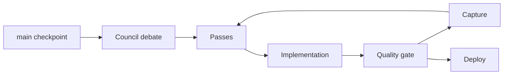

## Pass ledger

Slices 01–07 built the pure core; 09 was the v2 swap; 10–15 the game systems;
16 the captures and cleanup. Full narrative in `ORCHESTRATOR-LOG.md`.

| Pass | Council agents | Change | Gate | Capture |
| ---: | ---: | --- | ---: | --- |
| 01 | 0 | `hash.js` PRNG | 40/40 | — |
| 02 | 0 | neighborhood, chunks, wrap, graph | 50/50 | — |
| 03 | 0 | districts and anchors | 59/59 | — |
| 04 | 0 | fixtures and four rules | 67/67 | — |
| 05 | 0 | `rules.js` portal, breath, persistence | 78/78 | — |
| 06 | 0 | `creature.js` awareness and state machine | 101/101 | — |
| 07 | 0 | pathing and the two ladders | 115/115 | — |
| 08 | 0 | player breath and two verbs | 123/123 | — |
| 09 | 0 | **the swap** — `streetView.js`, v2 world | 130/130 | — |
| 10 | 0 | creature view and the capture loop | green | — |
| 11 | 0 | audio | green | — |
| 12 | 0 | HUD and accessibility | green | — |
| 13 | 0 | the finale and the win | green | — |
| 14 | 0 | `verify-world.mjs` repaired into the gate | 43/43 world | — |
| 15 | 0 | balance simulation; three real bugs | green | — |
| 16 | 0 | v1 deleted, capture harness, 14-frame gallery | 184/184 · 43/43 | 14/14 |

## Gallery

`npm run capture` photographs all fourteen §16.5 states from a headless Chrome
(SwiftShader) at seed 1337. Every frame is measured before it is kept and is
rejected if it falls under its luma floor, so a black rectangle can never sit in
the gallery wearing a view's name. Mean luma **57.006%** against a 6% floor; the
tightest margin is `win` at 10.1% against its 6% floor.

<table>
  <tr><td>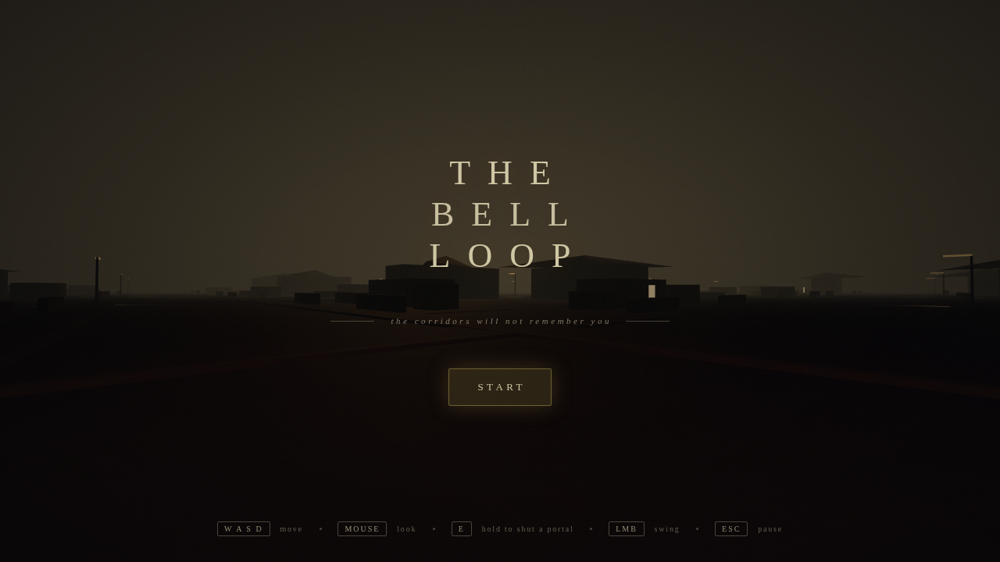<br>Title</td><td>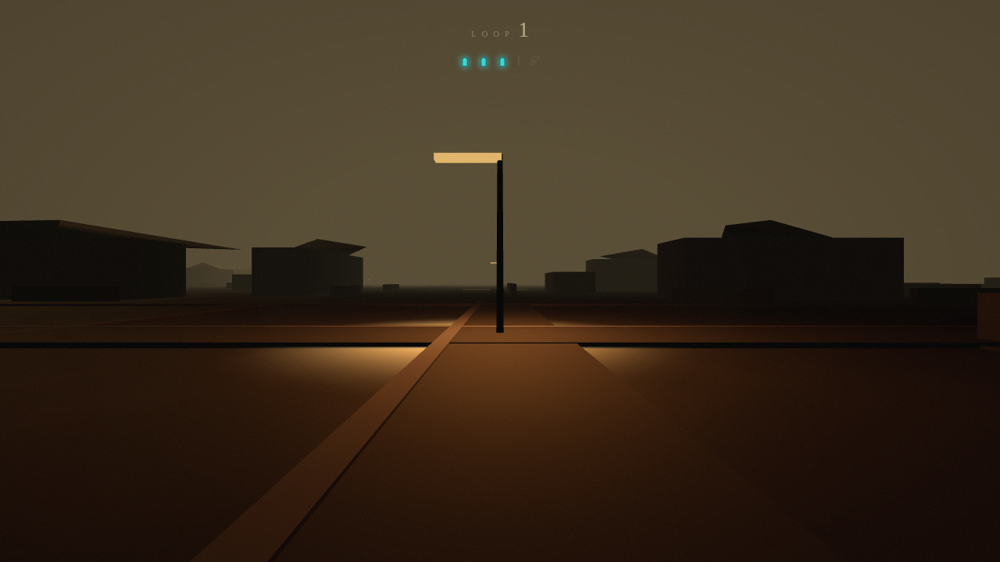<br>Street</td></tr>
  <tr><td>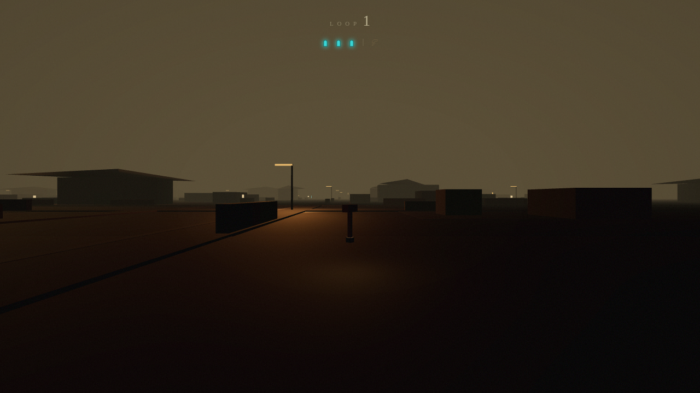<br>Hammer located</td><td>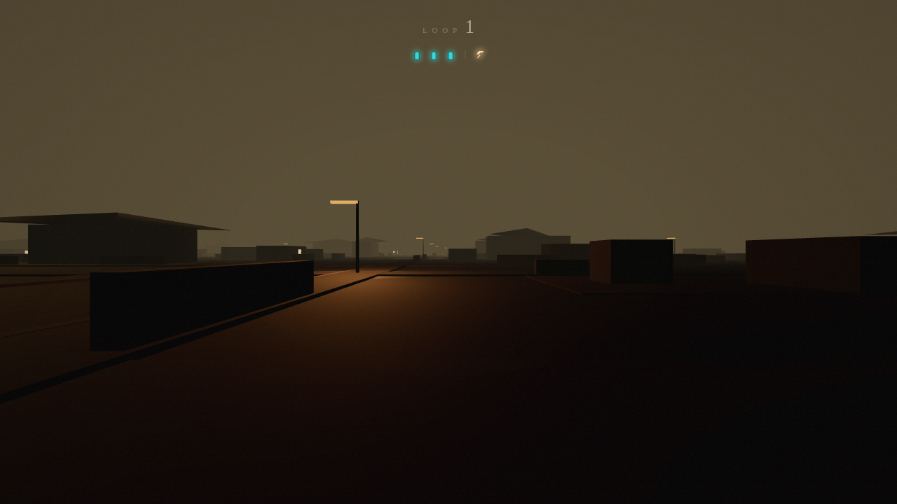<br>Hammer awakening</td></tr>
  <tr><td>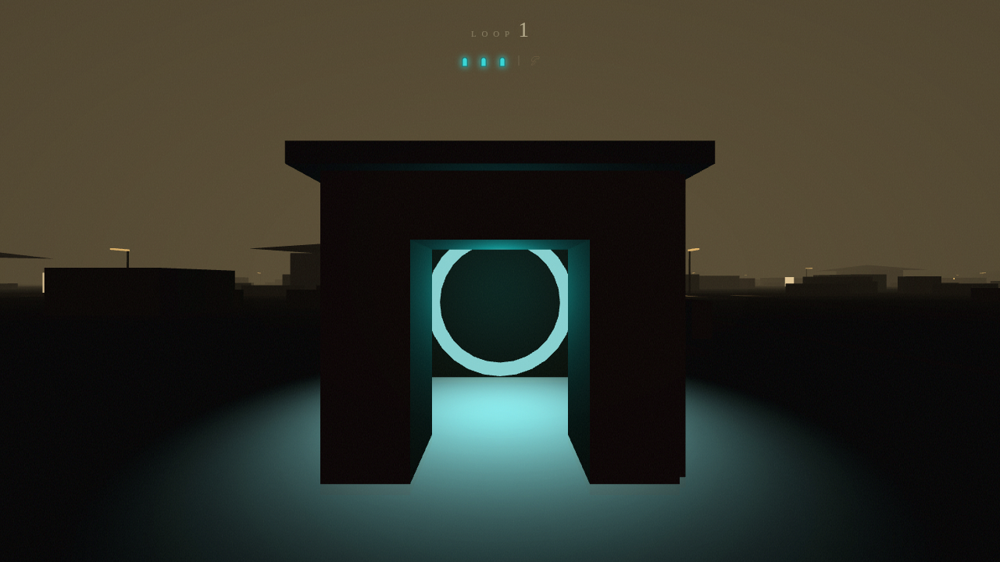<br>Portal located</td><td>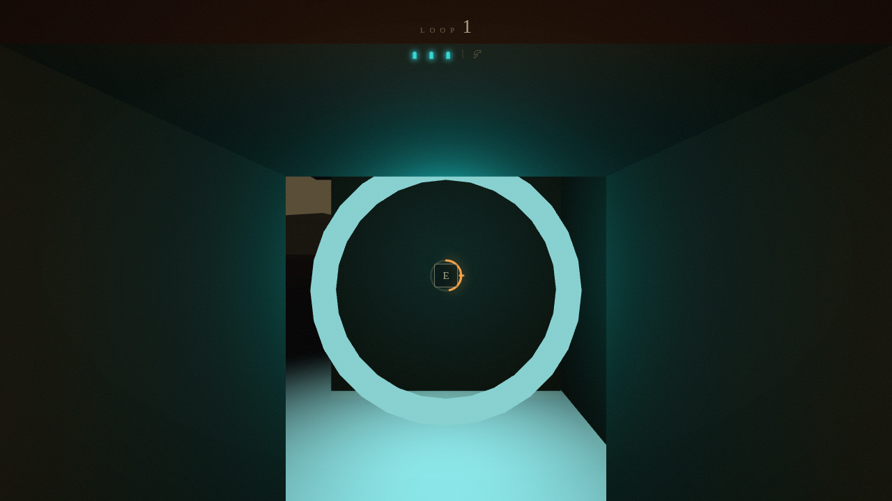<br>Portal shutdown</td></tr>
  <tr><td><br>Creature stalking</td><td>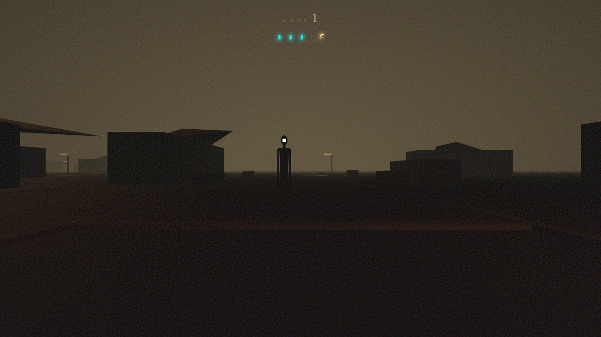<br>Creature chasing</td></tr>
  <tr><td>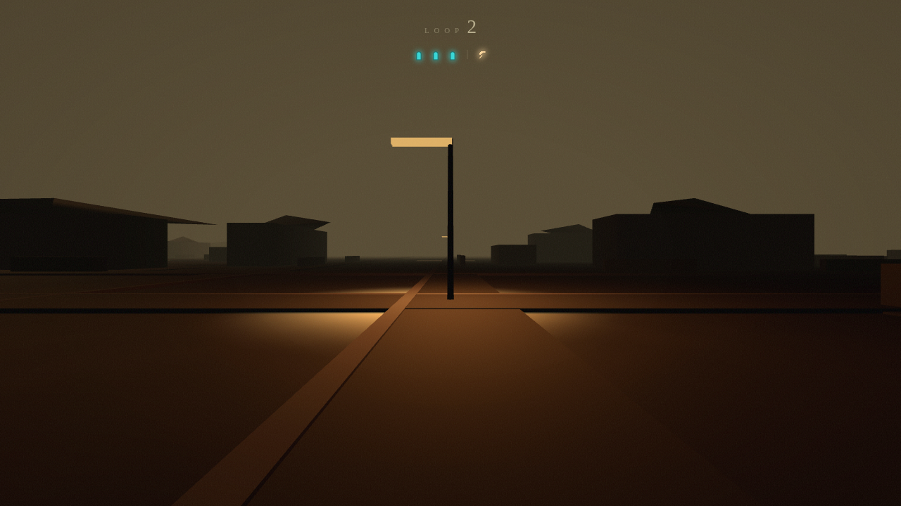<br>Capture reset</td><td>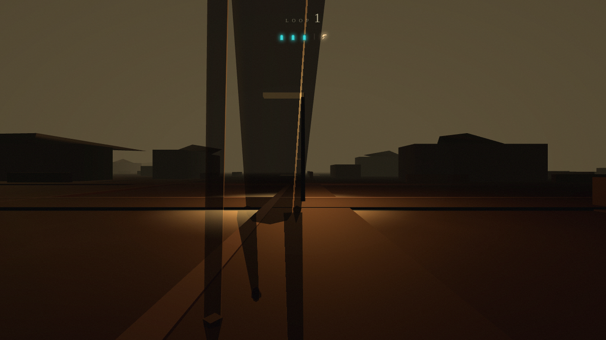<br>Banish</td></tr>
  <tr><td>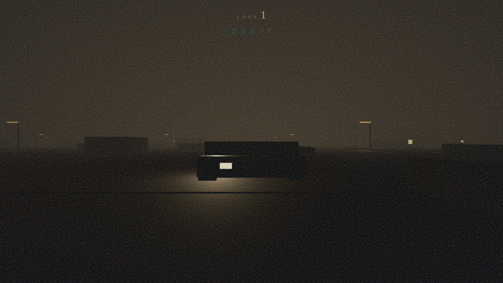<br>Finale headlights</td><td>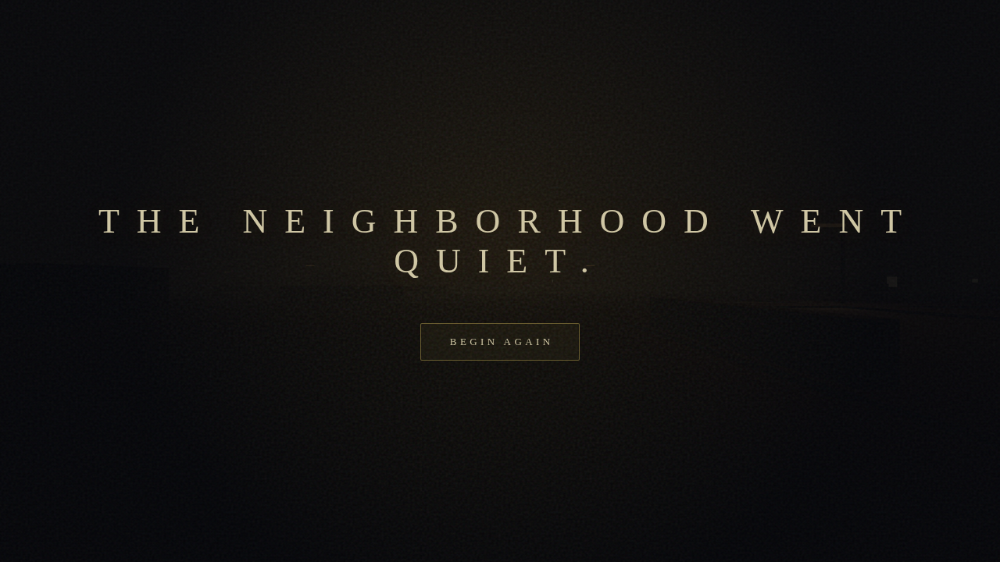<br>Win</td></tr>
</table>

Responsive and pause states, captured in addition to the twelve above:

<table>
  <tr><td>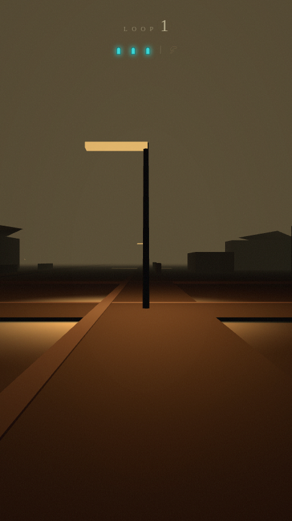<br>Responsive</td><td>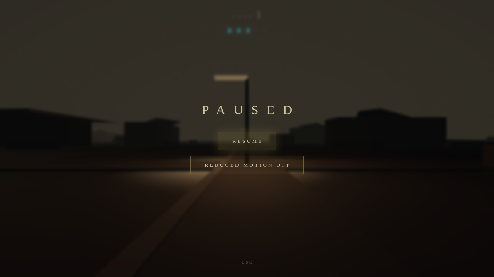<br>Pause</td></tr>
</table>

## Delta from `main`

### Logic

- v1's `maze.js` and `loop.js` are **deleted**. `verify.mjs` asserts both files
  are gone, that no file under `src/` can import them, and that what survived
  moved to `src/game/store.js` — the phase table and the store.
- Added `rules.js` (portal, breath, persistence), `creature.js` (7-state
  machine incl. STAGGER/REPOSITION), `neighborhood.js` (49-node street graph,
  BFS pathing), and `hash.js`.
- **Slice 15 fixed a rules bug, not a tuning number:** §6.2's sound table is
  distances, but `world.js` never supplied `event.distance`, so it defaulted to
  `0` and every footstep, sprint, toll and shutdown was heard at full strength
  from anywhere in the 448 m neighbourhood. The creature was permanently
  acquired from the first Act II footstep, which made Act II unmeasurable
  rather than merely mistuned. Distance is now measured from the creature.

### Rendering and atmosphere

- `streetView.js` replaces v1's flat corridor view: 49 chunks × 3 wrapped
  copies, ~760 colliders, 18 instanced pools.
- A real street is built once and the map wraps around it, rather than geometry
  being streamed per frame.
- `creatureView.js` draws the same creature the AI simulates: `nearestImage`
  folds the creature to the nearest wrapped image of its canonical coordinate, so
  picture and AI are the same entity by construction.

### Audio

- §13 made the sound table **half data**: the events and their radii are
  declared as data and the mixer is generic. Exhausted breath is a continuous
  `still` event on the creature's own table.

### UX and accessibility

- `src/ui/hud.js` is a pure projection of game state and is closed — the HUD
  cannot invent a value the simulation does not have. v1's `hudSnapshot` was
  deleted rather than adapted.
- `PauseOverlay.jsx` added; the pause state is captured.

### Performance

- Rendering moved from per-frame streaming to a prebuilt street with wrap and
  instanced pools.
- Recentre folds the map **and** the creature position, once per frame, in the
  one place the wrap moves.

### Tests and tooling

- `verify-world.mjs` was **repaired and added to the gate** (43 world checks).
  `npm run check` is `lint && verify && verify:world && build`.
- New: `tools/capture.mjs` + `png-luma.mjs` (the harness), `capture.html` and
  `capture/main.jsx` (a separate entry point that never reaches `dist/`), and
  `src/game/capture.js` (the §16.5 view table as pure data).
- The gate now asserts the gallery is real: every PNG must exist and exceed a
  20 KB blank-frame floor, and `benchmark/captures.json` must list all fourteen
  ids with zero failures — a stale PNG cannot be presented as this build.


## Reproduce

```bash
npm ci
npm run check
npm run capture   # optional: regenerates the 14-frame gallery
npm run dev
```

## Known debt

- **Deployed:** https://bell-loop.vercel.app (Vercel production, project
  `bell-loop`, team `project-by-aditya`).
- **No token or timing ledger was available to the agent runtime.** Token, cost,
  wall-time and active-time fields are recorded as `0` because the schema
  requires integers and no counter was readable. `0` here means **unrecorded**,
  not zero. AGENTS.md asks for non-cache and cache-read tokens separately; that
  split cannot be supplied truthfully yet.
- **`win` is the tightest frame** at 10.1% against a 6% floor (+4.1), followed by
  `title` at 8.19% against its 3.5% floor (+4.69). Under iteration 2 pass 1 the
  sodium retune lifted every frame, and the binding constraint moved off `title`
  for the first time — `title` had been the tightest margin since slice 16.
- **Two open oxlint warnings** remain, both pre-existing and non-fatal: an
  unused `dt` parameter in `world.js:698`, and a fast-refresh export warning in
  `capture/main.jsx:137`.
- **`portal-shutdown` captures hold at 0.556, not the scripted 0.667.** Hold
  progress is sampled when the screenshot is taken, so releasing `KeyE` between
  the scripted step and the capture decays the rendered value. 13.3/24 steps is
  past the loud-half threshold but before the latch, so the frame is
  representative — but the number here is the *rendered* progress, not the
  scripted one.
- **Design questions raised but deliberately not changed**, because they are
  design-table numbers and not this run's to move: (1) §10.2's "the gap is real
  and crossable" does not hold for a sustainable sprint — the breath duty cycle
  caps a sprinter at 4.54 m/s against the creature's 5.2; (2) the finale
  banish-re-emergence delay was measured and 1.5 s is right (raising it would
  only add dead time).
- **Not verifiable here:** whether the tuned 22 m stand-off reads as nerve or as
  a bug to a person holding a bell-hammer, and whether 0.945 → 0.829 across the
  balance pass is *felt* as the run getting easier. That needs a human playtest.
- The 14 gallery PNGs total ~12 MB, against ~850 KB of PNGs already on `main`.
  They are full 1280×720 captures; no PNG optimizer is available in this
  container, so they are committed as rendered.

