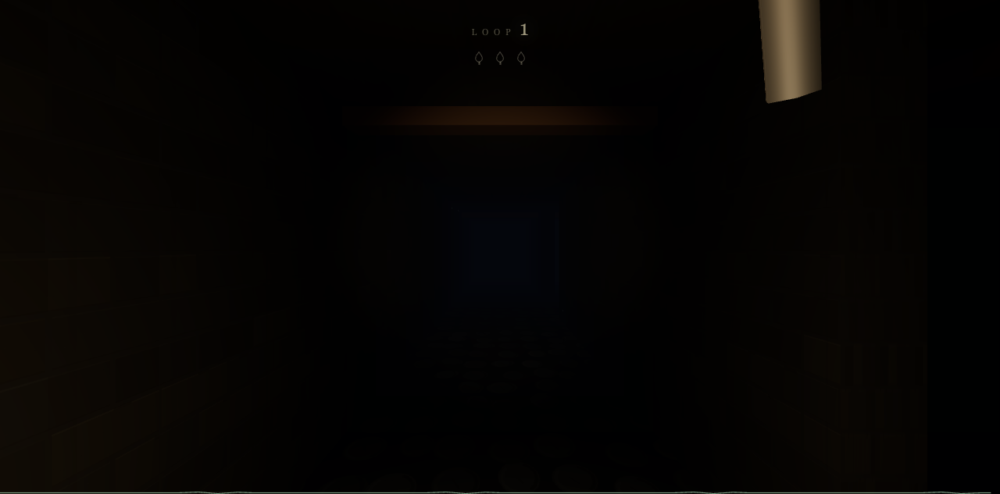

# THE BELL LOOP — MODEL BENCHMARK

`main` is the shared starting point for every model run. Each model branches from this checkpoint, works on the same deterministic Bell Loop game, and leaves a record of what changed, how it was tested, and where it can be played.

Read [`AGENTS.md`](AGENTS.md) for the workflow and [`benchmark/README.md`](benchmark/README.md) for the result format.

## Results

| Screenshot | Result |
| --- | --- |
|  | **Branch:** [`stealth/space-bunny`](https://github.com/puri-adityakumar/bell-loop/tree/stealth/space-bunny) **Model:** OpenCode `space-bunny-free` / `max` **Deployment:** [Vercel production](https://bell-loop-m7xph7s6z-project-by-aditya.vercel.app) |
|  | **Branch:** [`main`](https://github.com/puri-adityakumar/bell-loop/tree/main) **Model:** Grok 4.7 **Deployment:** pending |

Latest 45-second two-candle capture: [side-by-side video](benchmark/media/grok-4.7-vs-space-bunny.mp4) · [still](benchmark/media/grok-4.7-vs-space-bunny.png)
