# Result — stealth / space-bunny-alpha

## Run summary

**This branch is the iteration-2 result.** Two bounded runs sit on it: the
sixteen-slice v2 build (`bede4ed`, deployed to https://bell-loop.vercel.app)
and the twenty-pass iteration-2 close-out that follows it. The v2 swap is the
foundation and is unchanged; iteration 2 is what is on top of it.

Iteration 2 kept the deterministic seed, the loop rules and the win condition
comparable run-to-run, and changed the *look*, the *sound*, the *feel* and the
*evidence*. Sixteen passes of aesthetic work and four of verification: a sodium
amber dusk that is legible instead of merely dark, a portal rebuilt from a cyan
halo into an actual black hole with a debris ring and a shutdown collapse,
buildings with depth, a street with furniture and standing water, layered haze
and a pale moon, a creature that shimmers and drags a viscous trail, a
procedural world bed, and an original ambient score that ducks under the chase
and cuts to a single low tone at the finale.

Twenty passes is not twenty features' worth of value. The durable result is the
**gate**: 203 + 47 -> **306 + 113** checks, with no gate weakened, retuned or
deleted to get there, and nine reviewer findings that were defects in the
*checks themselves* -- a gate that could never execute, an instrument with no
gate at all, an assertion that returned the order of its own `if` statements, a
"bit-identical" claim that is false in 3.5% of the cases it claimed. A run that
reports its own instrument as untrustworthy is worth more than one that reports
only that the lights got nicer.

All sessions ran on **Space Bunny Alpha** (Cline provider, free tier),
implementer and reviewer alike. **$0.00.**

## Stats

Iteration 2 numbers, with the v2 baseline in the last column for scale.

| Metric | Value |
| --- | ---: |
| Runs | 2 (v2 sixteen slices + iteration 2's twenty passes) |
| Passes | 20 |
| Model | Space Bunny Alpha (Cline provider, free tier) |
| Task calls | 0 (unrecorded - see debt) |
| Persisted agents | 0 |
| General agents | 0 |
| Explore agents | 0 |
| Wall time | 0 ms (unrecorded - see debt) |
| Active agent time | 0 ms (unrecorded - see debt) |
| Input tokens | 0 (unrecorded - see debt) |
| Output tokens | 0 (unrecorded - see debt) |
| Reasoning tokens | 0 (unrecorded - see debt) |
| Cache read | 0 (unrecorded - see debt) |
| Cache write | 0 (unrecorded - see debt) |
| Non-cache tokens | 0 (unrecorded - see debt) |
| Total tokens | 0 (unrecorded - see debt) |
| Cost | $0.00 (free tier, every session) |
| Pure checks | **306/306** (from 203 at pass 3) |
| World checks | **113/113** (from 47 at pass 3) |
| Build | pass |
| Captures | 14/14, mean luma 51.266% (from 46.237%) |
| Tightest luma margin | `win` 10.85% lit against its 6% floor |
| Draw calls | 70/256 idle, 99/256 at the portal (from 111) |
| Triangles | 294 140/400 000 (from 50 990 at the slice-16 baseline) |
| `update()` p50 | 0.1 ms against a 4 ms ceiling |
| Gallery re-shoots | 2 (passes 3 and 16); **not** re-shot by the close-out |
| Deployment | **pending** - see the deploy recipe in `ORCHESTRATOR-LOG.md` |

## Workflow

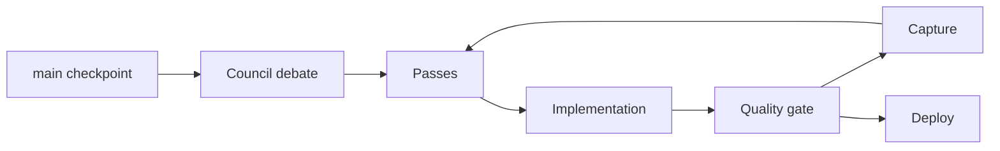
```mermaid
flowchart LR
  B[main checkpoint] --> C[Council debate]
  C --> P[Passes]
  P --> I[Implementation]
  I --> G[Quality gate]
  G --> C2[Capture]
  C2 --> P
  G --> D[Deploy]
```

## Pass ledger

Slices 01–07 built the pure core; 09 was the v2 swap; 10–15 the game systems;
16 the captures and cleanup. Full narrative in `ORCHESTRATOR-LOG.md`.

| Pass | Council agents | Change | Gate | Capture |
| ---: | ---: | --- | ---: | --- |
| 01 | 0 | `hash.js` PRNG | 40/40 | — |
| 02 | 0 | neighborhood, chunks, wrap, graph | 50/50 | — |
| 03 | 0 | districts and anchors | 59/59 | — |
| 04 | 0 | fixtures and four rules | 67/67 | — |
| 05 | 0 | `rules.js` portal, breath, persistence | 78/78 | — |
| 06 | 0 | `creature.js` awareness and state machine | 101/101 | — |
| 07 | 0 | pathing and the two ladders | 115/115 | — |
| 08 | 0 | player breath and two verbs | 123/123 | — |
| 09 | 0 | **the swap** — `streetView.js`, v2 world | 130/130 | — |
| 10 | 0 | creature view and the capture loop | green | — |
| 11 | 0 | audio | green | — |
| 12 | 0 | HUD and accessibility | green | — |
| 13 | 0 | the finale and the win | green | — |
| 14 | 0 | `verify-world.mjs` repaired into the gate | 43/43 world | — |
| 15 | 0 | balance simulation; three real bugs | green | — |
| 16 | 0 | v1 deleted, capture harness, 14-frame gallery | 184/184 · 43/43 | 14/14 |

### Iteration 2 — twenty passes

Gate counts are the **post-review** rung for each pass. `n/a` in the capture
column means the pass added no pixels and the gallery was correctly not
re-shot; a capture re-run is itself a thing a review checks for.

| Pass | Change | Gate (pure / world) | Capture |
| ---: | --- | ---: | --- |
| 01 | yellow-tinted cinematic dusk: sky, fog, hemisphere, exposure | 191 / 44 | 14/14 |
| 02 | sodium pools, warm bounce, fog as a depth cue, creature-separation gate | 198 / 44 | 14/14 |
| 03 | portal rebuilt as a black core disc with a hot rim and a slow swirl | 206 / 47 | 14/14 |
| 04 | aesthetic study of the sakuragaoka reference (`AESTHETIC-NOTES.md`) | 206 / 47 | n/a (docs) |
| 05 | building depth: inset windows, door recesses, rooflines, entry lamps | 214 / 55 | 14/14 |
| 06 | street furniture I: poles, catenary wires, signs, hydrants, grates | 218 / 62 | n/a |
| 07 | street furniture II: dumpsters, vending machines, bikes, shelters | 222 / 70 | n/a |
| 08 | water: lamp-streak puddles, drainage canal, wet-road darkening | 225 / 77 | n/a |
| 09 | sky II: haze bands, pale moon, horizon silhouettes, ash motes | 234 / 84 | n/a |
| 10 | creature fidelity I: idle motion, limb swing, viscous trail, eye flare | 244 / 89 | 14/14 (re-shoot) |
| 11 | creature fidelity II: heat haze, lamp flicker, glow pulse, dust puffs | 252 / 94 | n/a |
| 12 | portal II: swirl rotation, debris ring, collapse, lensing hint | 261 / 99 | n/a |
| 13 | sound I: room tone, facility sounds, wind layer, portal hum | 274 / 103 | n/a |
| 14 | sound II: ambient music, duck ladder, finale silence | 285 / 111 | n/a |
| 15 | creature in the new light: per-state presentation retune | 296 / 111 | n/a |
| 16 | full capture refresh; luma floors re-justified | 301 / 111 | **14/14 (re-shoot)** |
| 17 | performance: budget check, instancing where cheap, allocation sweep | 306 / 112 | n/a |
| 18 | game feel: sigil backdrop contrast, spawn framing (reverted) | 306 / 112 | n/a |
| 19 | debt sweep: review NOT-DONEs, dead code, docblocks match reality | 306 / 113 | n/a |
| **20** | **iteration-2 close-out: log, README, notes finalized** | **306 / 113** | n/a (docs) |

## Gallery

`npm run capture` photographs all fourteen §16.5 states from a headless Chrome
(SwiftShader) at seed 1337. Every frame is measured before it is kept and is
rejected if it falls under its luma floor, so a black rectangle can never sit in
the gallery wearing a view's name. These are the **pass-16 captures on the
iteration-2 look** (re-shot 2026-09-28); the mean is **51.266% lit** against a
6% floor, and the tightest margin is `win` at **10.85%** against its 6% floor
(+4.85). `title` is next at 48.46% against its 3.5% floor.

The gate is not only a floor. `verify-world.mjs` also reads the committed PNGs
and checks that the **eye is resolvable**, that the **silhouette is darker than
its surround** by a stated ratio, and that the anchor is within a stated radius
of the head the view stages - which is how pass 15's review proved the old
`banish.png` "eye" was a lit window 650 px from the creature.

<table>
  <tr><td>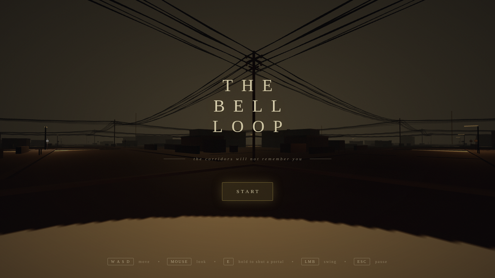<br>Title</td><td>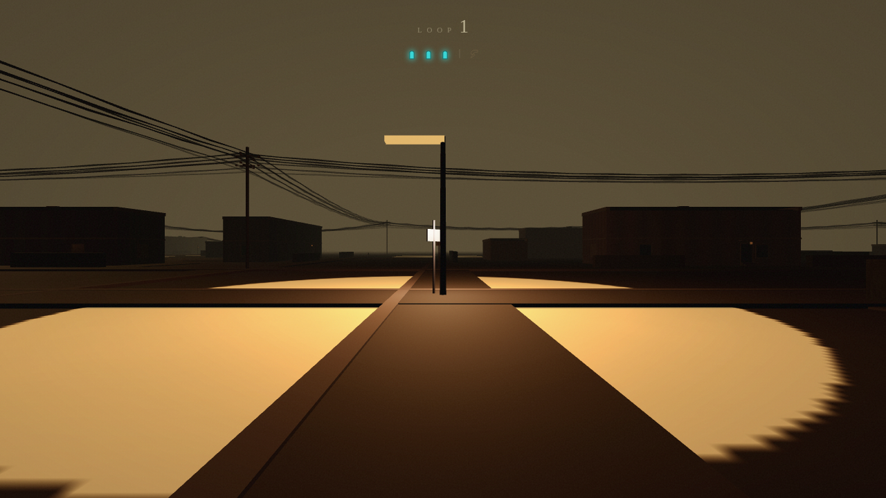<br>Street</td></tr>
  <tr><td>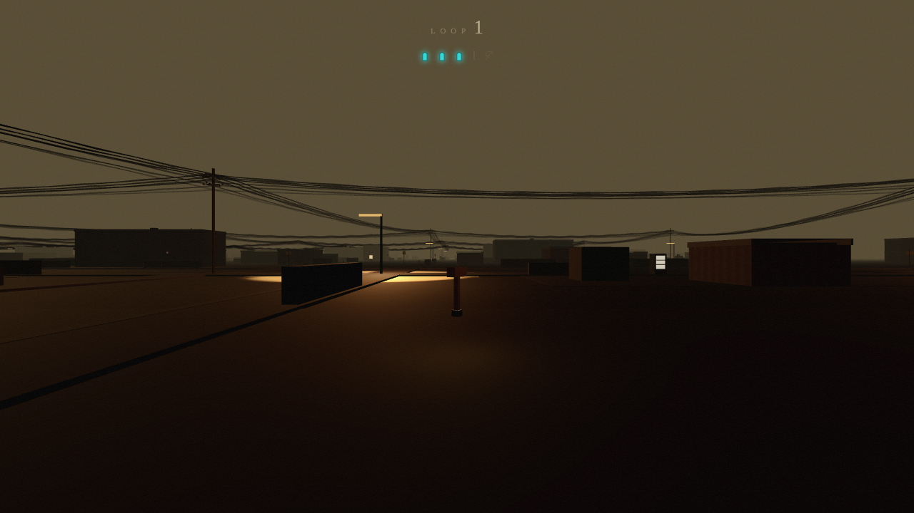<br>Hammer located</td><td>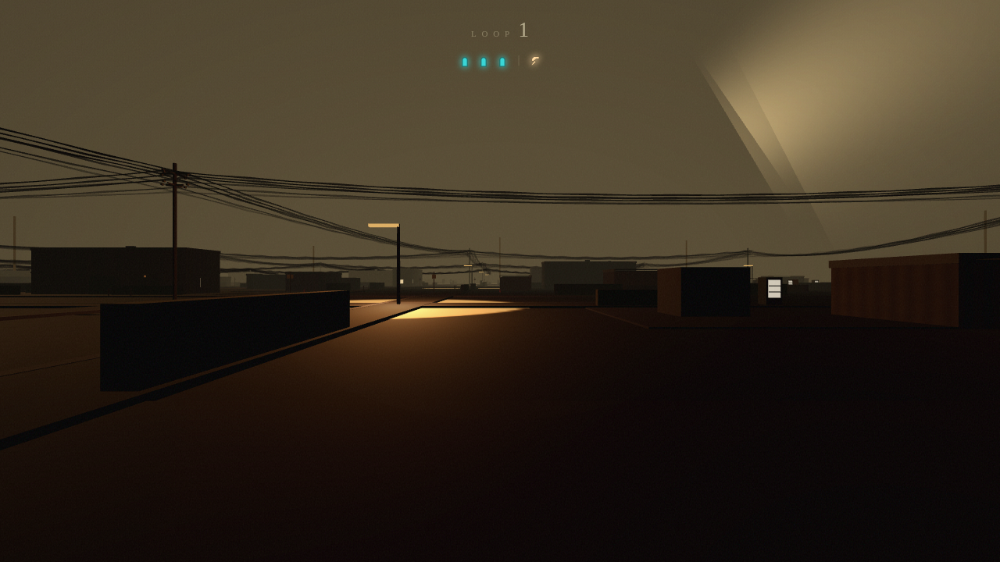<br>Hammer awakening</td></tr>
  <tr><td>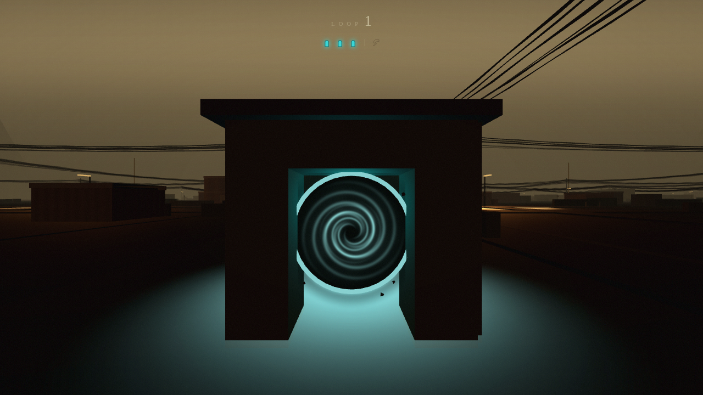<br>Portal located</td><td>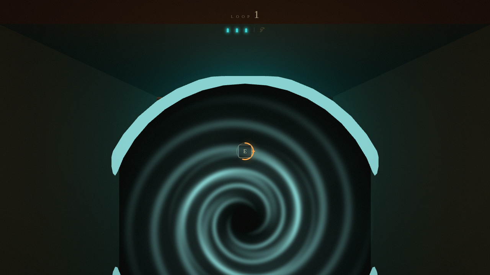<br>Portal shutdown</td></tr>
  <tr><td>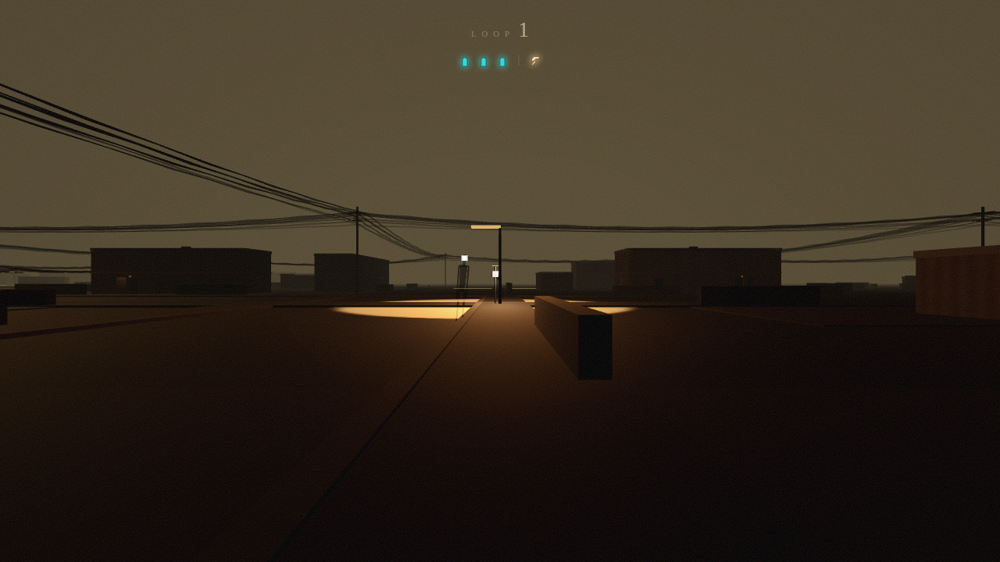<br>Creature stalking</td><td>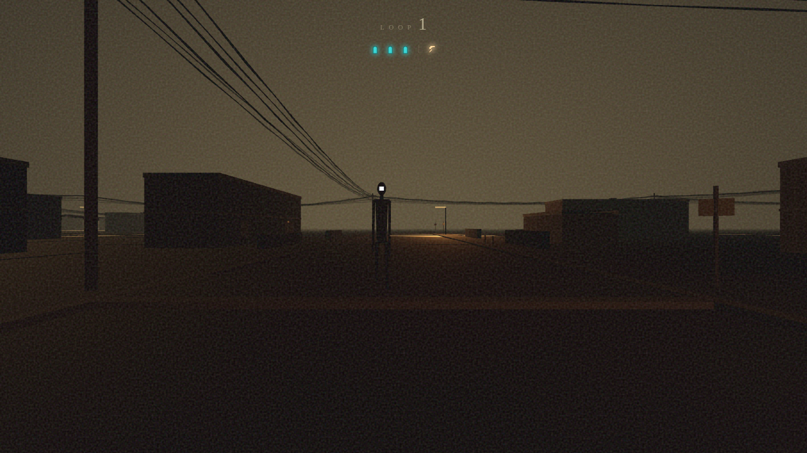<br>Creature chasing</td></tr>
  <tr><td>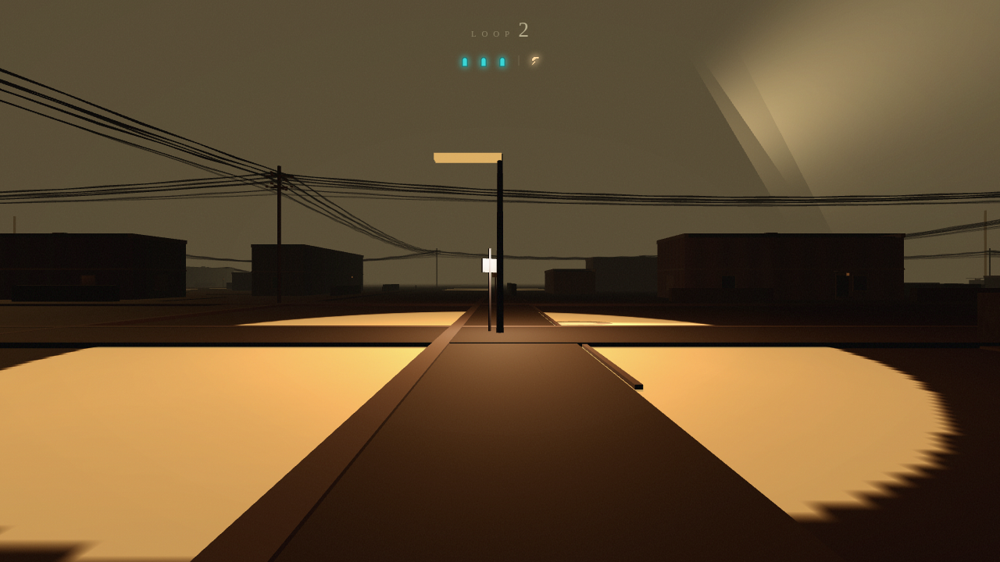<br>Capture reset</td><td>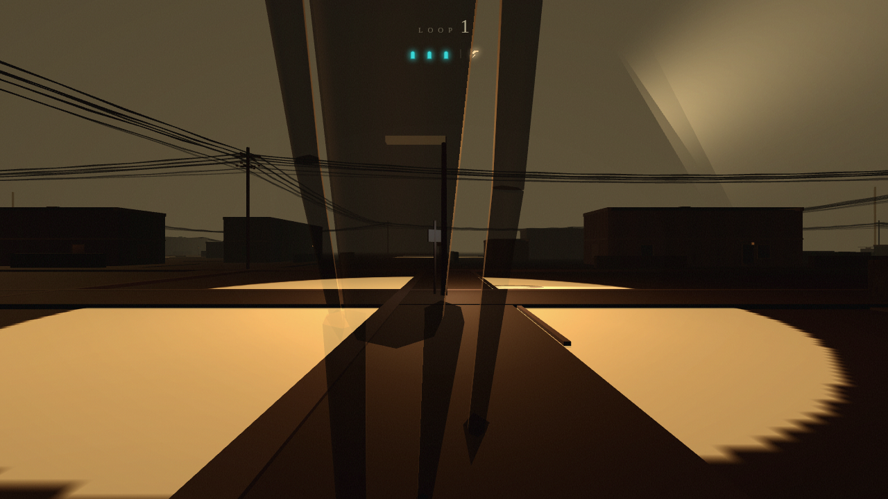<br>Banish</td></tr>
  <tr><td>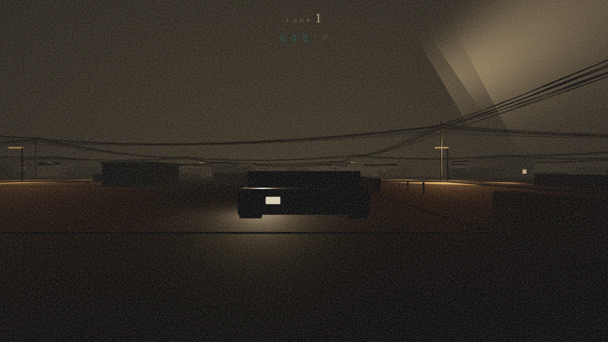<br>Finale headlights</td><td>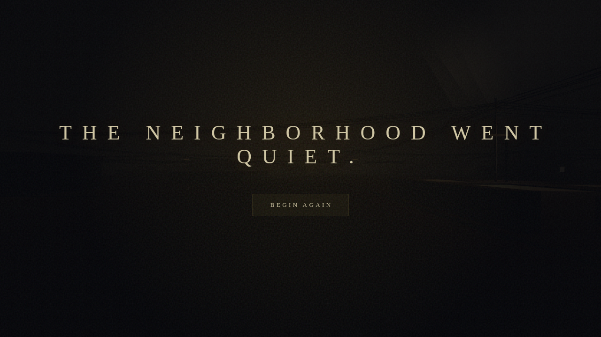<br>Win</td></tr>
</table>

Responsive and pause states, captured in addition to the twelve above:

<table>
  <tr><td>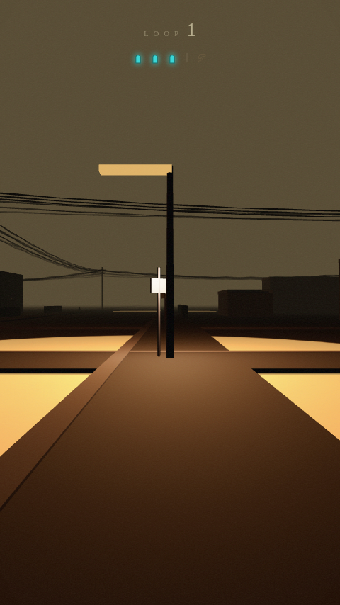<br>Responsive</td><td>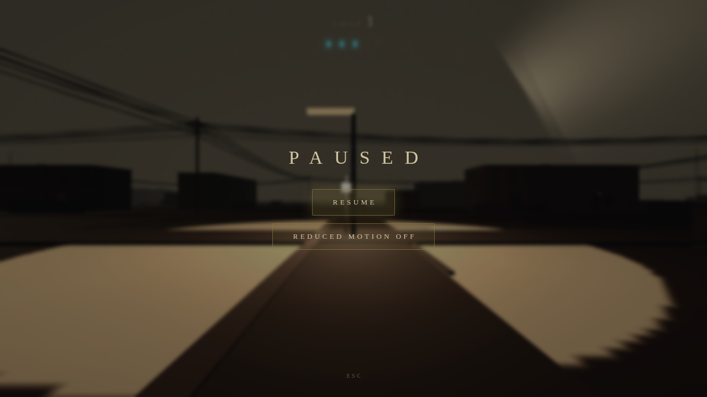<br>Pause</td></tr>
</table>

## What iteration 2 changed

Read this first if you want to know what the twenty passes bought. Each row
names the pass that owns it, and each is a thing a reviewer checked against the
committed pixels or the built world, not a claim.

### Light

- **Sodium-amber dusk (p1–2).** The v2 sky and fog were violet-dark
  (`0x2a2233 / 0x4a3550 / 0x12101a`) and the exposure curve punished the player
  for looking into a dark street. Retuned to warm sodium haze, hemisphere raised,
  and the exposure curve reworked, so darkness reads as *dusk* and not as a
  broken render. Fog became a depth cue rather than a wall: density falls near
  the lamps. Verified on the committed `street.png` and `title.png`, and a
  localized creature-contrast gate was added because brightening a background
  silently un-silhouettes a foreground.

### Portal

- **Black hole, not halo (p3).** The v2 portal was a cyan torus and read as a
  ring. Rebuilt as a near-black core disc filling the doorway, a bright hot rim,
  and a slow swirl, keeping the cyan identity and the ground apron. A shut
  portal is a cold, dim, inert disc.
- **Portal II (p12).** Swirl rotation, a debris ring, a shutdown collapse, and a
  lensing hint. The swirl is a deterministic function of the world clock, not a
  frame count, so it is re-takeable.

### 3D fidelity

- **Buildings have depth (p5).** Inset windows with emissive variance, door
  recesses, steps, roofline silhouettes, wall-mounted entry lamps.
- **Street furniture I and II (p6–7).** Poles with catenary wires between
  them, signs, hydrants, drain grates; dumpsters, vending machines, bins, bikes,
  bollards, dim bus-shelter ad panels.
- **Ground (p8).** Faded centre dashes, kerb joints, sidewalk seams, manholes,
  patch repairs, wet-road darkening near drains.
- **Water (p8).** Lamp-streak puddles and a drainage canal, placed on the
  district rules and gated in pool-occupancy units.
- **Sky and atmosphere (p9).** Haze bands, a pale moon, distant horizon
  silhouettes, drifting ash motes, and cloud bands catching sodium glow. Stars
  are absent on purpose: haze, not a clear night.

### Creature

- **Fidelity I and II (p10–11).** Idle micro-motion on two unrelated periods,
  two-jointed arms with an elbow lag, a viscous trail laid on a stride reducer,
  an eye flare on first sighting, a heat-haze shimmer column, a lamp-dread
  strobe, a glow pulse and footfall dust.
- **Presentation in the new light (p15).** Per-state retune so the silhouette
  and eye still read against amber fog in every state. The probe measures
  telegraph presence 0.78, a silhouette ratio under 0.62, and an eye margin of
  +77 luma on a real creature.

### Sound

- **The world bed (p13).** Low room tone, distant facility rumbles and clanks on
  a seeded schedule panned and damped by distance, a wind layer that follows the
  drifting haze bands, and a second distance channel on the portal hum. All
  seeded, all `kind: null` so the creature cannot hear them. The `setTimeout`
  ambience scheduler is gone: three cursor streams on the world's own `dt`
  replaced it, so the bed no longer breathes through a pause and can be
  asserted at all.
- **The ambient music (p14).** An original pad progression in A natural minor at
  54 BPM, with tape wobble, hiss, and an occasional distant motif. It ducks on
  the creature's own ladder, and at the finale the music cuts in 0.12 s while
  one low tone rises over 1.6 s from *below* the ladder's gain, so the cut
  cannot take it with it. The world bed keeps breathing through the finale.

### Performance and feel

- **Budget (p17).** Measured on the real renderer: draw calls 70 idle and 99 at
  the portal against a 256 ceiling, triangles 294 140 against 400 000,
  `update()` 0.1 ms against 4 ms. The forty-two-mesh horizon ring became one
  instanced mesh, and a per-frame allocation sweep removed 415 allocations.
- **Game feel (p18).** A sigil backdrop is painted behind the sigil row so the
  contrast gate measures against a real plate rather than the page background.
  Reduced motion is still respected and still gated.

### Verification, which is the actual iteration-2 story

- **Reproducible capture (p16, p19).** The capture clock is anchored and a run
  is worth the same picture twice: every world-time field is bit-identical
  between repeat runs, and only the rasteriser's luma moves.
- **Mutation-tested gates.** The pattern of the second half of the run is that a
  claim is not believed until a mutation aimed at it turns the suite red. The
  suite carries named mutants for its own claims, and reviews that found a
  surviving mutant fixed the gate rather than the count.
- **The close-out (p20) is documentation only.** It changed no source, moved no
  gate, and re-shot no frame.

## Controls

| Input | Action |
| --- | --- |
| `W` `A` `S` `D` / arrows | move |
| mouse | look (pointer lock) |
| `Shift` | sprint (costs breath) |
| `E` (hold) | shut a portal / pick up the hammer |
| left mouse | swing the bell-hammer |
| `Esc` | pause |
| `F` | toggle the FPS readout |

The win condition is unchanged from v2 and is deliberately so: find the
bell-hammer, shut three portals, and reach the car at the far edge of the
neighbourhood while something follows you.

## Running it

```bash
npm ci
npm run check     # lint + 306 pure + 113 world + build
npm run dev       # play it
npm run capture   # re-photograph the 14-frame gallery (~10 min, needs a browser)
```

## Delta from `main`

Everything below is the **v2 sixteen-slice** delta, which iteration 2 inherited
rather than rewrote. The iteration-2 delta is the section above.

### Logic

- v1's `maze.js` and `loop.js` are **deleted**. `verify.mjs` asserts both files
  are gone, that no file under `src/` can import them, and that what survived
  moved to `src/game/store.js` — the phase table and the store.
- Added `rules.js` (portal, breath, persistence), `creature.js` (7-state
  machine incl. STAGGER/REPOSITION), `neighborhood.js` (49-node street graph,
  BFS pathing), and `hash.js`.
- **Slice 15 fixed a rules bug, not a tuning number:** §6.2's sound table is
  distances, but `world.js` never supplied `event.distance`, so it defaulted to
  `0` and every footstep, sprint, toll and shutdown was heard at full strength
  from anywhere in the 448 m neighbourhood. The creature was permanently
  acquired from the first Act II footstep, which made Act II unmeasurable
  rather than merely mistuned. Distance is now measured from the creature.

### Rendering and atmosphere

- `streetView.js` replaces v1's flat corridor view: 49 chunks × 3 wrapped
  copies, ~760 colliders, 18 instanced pools.
- A real street is built once and the map wraps around it, rather than geometry
  being streamed per frame.
- `creatureView.js` draws the same creature the AI simulates: `nearestImage`
  folds the creature to the nearest wrapped image of its canonical coordinate, so
  picture and AI are the same entity by construction.

### Audio

- §13 made the sound table **half data**: the events and their radii are
  declared as data and the mixer is generic. Exhausted breath is a continuous
  `still` event on the creature's own table.

### UX and accessibility

- `src/ui/hud.js` is a pure projection of game state and is closed — the HUD
  cannot invent a value the simulation does not have. v1's `hudSnapshot` was
  deleted rather than adapted.
- `PauseOverlay.jsx` added; the pause state is captured.

### Performance

- Rendering moved from per-frame streaming to a prebuilt street with wrap and
  instanced pools.
- Recentre folds the map **and** the creature position, once per frame, in the
  one place the wrap moves.

### Tests and tooling

- `verify-world.mjs` was **repaired and added to the gate** (now 113 world checks).
  `npm run check` is `lint && verify && verify:world && build`.
- New: `tools/capture.mjs` + `png-luma.mjs` (the harness), `capture.html` and
  `capture/main.jsx` (a separate entry point that never reaches `dist/`), and
  `src/game/capture.js` (the §16.5 view table as pure data).
- The gate now asserts the gallery is real: every PNG must exist and exceed a
  20 KB blank-frame floor, and `benchmark/captures.json` must list all fourteen
  ids with zero failures — a stale PNG cannot be presented as this build.


## Reproduce

`npm run check` is the whole gate and is the precondition for anything else:

```bash
npm ci
npm run check     # lint + 306 pure + 113 world + vite build
npm run dev       # play it
```

Determinism is by seed: the capture harness pins seed 1337, and the same step
list at the same seed produces the same world. Re-photographing is
`npm run capture` and is **not** required to reproduce the result - the
committed gallery is part of the record, and a capture re-run that changes
nothing meaningful is a 14-minute way to learn nothing.

The deploy is not reproducible from this branch by the agent: the Vercel CLI is
present and unauthenticated, and the exact recipe for whoever holds the token
is in `ORCHESTRATOR-LOG.md` under "Deploy recipe - FOR THE ORCHESTRATOR".

## Where the record lives

| File | What it is |
| --- | --- |
| `GAMEDESIGN.md` | the design authority — 16 sections, and the numbers every gate pins |
| `AESTHETIC-NOTES.md` | the **iteration-2 aesthetic record**: the reference study, what was taken and refused, the music rules, and the measured performance budget |
| `ITERATION-2-CHECKLIST.md` | the twenty-pass plan, each row annotated with what the pass actually did |
| `ORCHESTRATOR-LOG.md` | the full narrative, the 43-commit chain, the reviewer findings, and the deploy recipe |
| `REVIEW-pass-N.md` | nineteen independent reviews — the skeptical half of every pass |
| `benchmark/captures.json` | the machine-readable capture report: per-frame luma, floors, and furniture census |

## Known debt

- **Iteration 2 is NOT deployed.** The deploy is owned by the orchestrator, which
  holds the Vercel credentials; pass 20 deliberately did not attempt it. Target
  project: **`space-bunny-v2`** -> https://https://space-bunny-v2.vercel.app. That URL
  is a **placeholder for the target, not a live claim** - it resolves to nothing
  until the recipe in `ORCHESTRATOR-LOG.md` is run. The v1 deployment at
  https://bell-loop.vercel.app (project `bell-loop`, team `project-by-aditya`) is
  live and still serving iteration 1.
- **SSO protection must be disabled on the new project before it is announced.**
  A Vercel project with Deployment Protection on returns a 302 to a login page
  for every anonymous visitor, and the deploy still reports success - the
  failure is silent and looks like a working URL until someone opens it. The
  `PATCH /v9/projects/<id>` step in the recipe exists for exactly this.
- **No token or timing ledger was available to the agent runtime.** Token, cost,
  wall-time and active-time fields are recorded as `0` because the schema
  requires integers and no counter was readable. `0` here means **unrecorded**,
  not zero. AGENTS.md asks for non-cache and cache-read tokens separately; that
  split cannot be supplied truthfully yet.
- **`win` is the tightest frame** at 10.85% lit against its 6% floor (+4.85),
  followed by `title` at 48.46% against its 3.5% floor. Under iteration 2 pass 1
  the sodium retune lifted every frame and the binding constraint moved off
  `title` for the first time - `title` had been the tightest margin since slice
  16. It is `win` because a win card is mostly black by design, which is the
  right answer for the frame and a standing risk for the gate.
- **Five open oxlint warnings** remain, all pre-existing and all non-fatal: an
  unused `dt` parameter in `src/game/world.js`, a fast-refresh export warning in
  `capture/main.jsx`, and three unused local functions in `verify-world.mjs`
  (`nodeTable`, `nearestNode`, `packedLuma`). None is load-bearing; all are
  recorded rather than silenced, because a lint warning deleted to make a
  count look better is a warning that can no longer tell anyone anything.
- **`portal-shutdown` captures hold at 0.556, not the scripted 0.667.** Hold
  progress is sampled when the screenshot is taken, so releasing `KeyE` between
  the scripted step and the capture decays the rendered value. 13.3/24 steps is
  past the loud-half threshold but before the latch, so the frame is
  representative — but the number here is the *rendered* progress, not the
  scripted one.
- **Design questions raised but deliberately not changed**, because they are
  design-table numbers and not this run's to move: (1) §10.2's "the gap is real
  and crossable" does not hold for a sustainable sprint — the breath duty cycle
  caps a sprinter at 4.54 m/s against the creature's 5.2; (2) the finale
  banish-re-emergence delay was measured and 1.5 s is right (raising it would
  only add dead time).
- **The spawn-framing win was unshippable, and the reason is architectural.**
  Pass 18 reframed the opening (a candidate spawn 26.5 m down the road, to put a
  lamp in frame and open the sightline) and **reverted it**: the world's own
  suite went **112 → 110 → 108 of 112**. `SPAWN.position` looks like a framing
  knob and is a simulation constant — `_firstSightingPoint` reads it to place the
  Act I apparition, so moving the body moves which node the sighting is drawn on.
  The honest residual is smaller than the original claim: the shipped opening
  has no lamp in the first 37 m, and the retracted "15.4 m wall" was a
  `POLE_DIAMETER` footprint the kinded occluder ray reports **OPEN**. Written up
  in full, with the numbers, in `GAMEDESIGN.md` §16.6.1. The consequence for
  anyone reading the gate: **the first-30-seconds check asserts the ORDER of the
  opening beats and no durations at all**, because a duration would be a number
  this run has no authority to choose.
- **Not verifiable here:** whether the tuned 22 m stand-off reads as nerve or as
  a bug to a person holding a bell-hammer, and whether 0.945 → 0.829 across the
  balance pass is *felt* as the run getting easier. That needs a human playtest.
- **The gallery is not byte-reproducible, and this is a property of the
  rasteriser, not of the harness.** The capture clock is anchored: between two
  runs of the same step list at seed 1337, **every world-time field is
  bit-identical** - `clock.*`, `pose.*`, `where.*`, `hold.*`, `awareness.*`,
  `creature.*`, `portals.*`, `furniture.*` - and only the rasterised luma moves,
  by 0.13-1.18 points. The residual is SwiftShader's, and a committed PNG
  therefore cannot be regenerated byte-for-byte on a different machine or under
  different load. The gate asserts the *world* is the same picture twice, which
  is the strongest form of §6.5 that is checkable here, and the luma floors
  are re-justified on the numbers actually shipped rather than on an assertion
  of exactness.
- **Pass 16's shimmer floor is a documented, reproducibly failing debt.** The
  creature probe's heat-haze floor (0.6 luma) fails 12/12 on the shipped
  stalker - band +1.87 and +1.82 on two runs. It is now failing *consistently*
  rather than noisily, which is what makes it re-measurable. It is a real open
  item on the creature's readability in amber fog, not a rounding artefact, and
  no pass retuned the floor to make it go away.
- **The 14 gallery PNGs total ~14 MB**, against ~850 KB of PNGs already on
  `main`. They are full 1280×720 captures; no PNG optimizer is available in
  this container, so they are committed as rendered.

