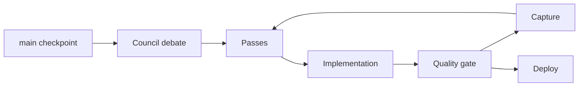

# Result — Provider / Model

## Run summary

Describe the model, provider, variant, task prompt, and final result in one paragraph.

## Stats

| Metric | Value |
| --- | ---: |
| Runs | 0 |
| Passes | 0 |
| Task calls | 0 |
| Persisted agents | 0 |
| General agents | 0 |
| Explore agents | 0 |
| Wall time | 0 ms |
| Active agent time | 0 ms |
| Input tokens | 0 |
| Output tokens | 0 |
| Reasoning tokens | 0 |
| Cache read | 0 |
| Cache write | 0 |
| Non-cache tokens | 0 |
| Total tokens | 0 |
| Cost | $0.00 |
| Pure checks | 0/0 |
| World checks | 0/0 |
| Build | not-run |

## Workflow



## Pass ledger

| Pass | Council agents | Change | Gate | Capture |
| ---: | ---: | --- | --- | --- |
| 01 | 0 | TBD | TBD | TBD |

## Gallery

Use six rows with two screenshots per row.

<table>
  <tr><td><br>Title</td><td><br>Entry</td></tr>
  <tr><td><br>Shrine</td><td><br>Door</td></tr>
  <tr><td><br>Reset</td><td><br>Pause</td></tr>
  <tr><td><br>Win</td><td><br>Short landscape</td></tr>
  <tr><td><br>Detail A</td><td><br>Detail B</td></tr>
  <tr><td><br>Detail C</td><td><br>Detail D</td></tr>
</table>

## Delta from `main`

### Logic

- TBD

### Rendering and atmosphere

- TBD

### Audio

- TBD

### UX and accessibility

- TBD

### Performance

- TBD

### Tests and tooling

- TBD

## Reproduce

```bash
npm ci
npm run check
npm run dev
```

## Known debt

- TBD
